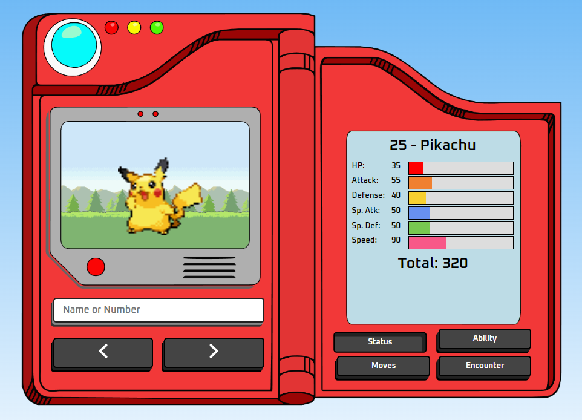

<h1 align="center">
    Pokédex
</h1>

## 💻 Sobre o projeto

Pokedex feita em Javascript com consumo de uma API para consulta dos dados.

---

## ⚙️ Funcionalidades

- Consulta os dados dos Pokémons por ID ou nome;
- Mostra todos os dados dos pokémons na tela da direita;
- Mostra a imagem dos pokémons na tela da esquerda;
- Responsivo.

---

## 📷 Imagens do projeto

  

---

## 🚀 Como executar o projeto

Abrir o link do projeto: https://lucaswmlima.github.io/javascript-pokedex/

---

## 🛠 Tecnologias utilizadas

Foram utilizadas as seguintes ferramentas: HTML, CSS, Javascript, Rest API.

---

## 👨‍💻 Autor
 
 <b>Lucas William Martins Lima</b> 
 <b>LinkedIn: https://www.linkedin.com/in/lucaswmlima</b> 
 <b>Portifólio: https://portifolio-lucaswilliam.vercel.app</b> 
 <b>Github: https://github.com/lucaswmlima</b> 
 
---
